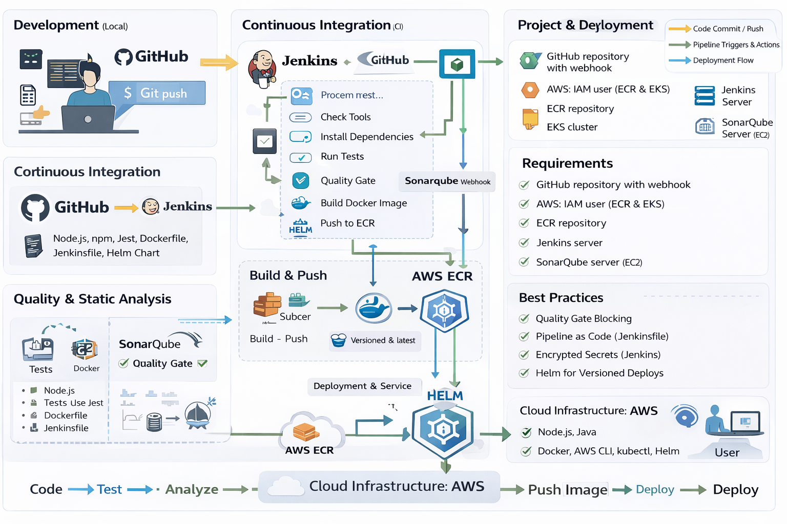

# 🚀 DevOps CI/CD Pipeline with Jenkins, SonarQube, Docker, ECR, EKS & Helm

## 📌 Overview

This project demonstrates a **production-style CI/CD pipeline** for a Node.js application using modern DevOps tools and AWS services.

The pipeline automates:

* Code build and testing
* Code quality analysis
* Docker image creation
* Image storage in AWS ECR
* Deployment to Kubernetes (EKS) using Helm

---

## 🧠 Architecture Summary

```
GitHub → Jenkins → Test → SonarQube → Quality Gate → Docker → ECR → EKS (Helm)
```




---

## 🛠️ Technologies Used

### 🔹 CI/CD & Automation

* Jenkins (Pipeline as Code)

### 🔹 Code & Testing

* Node.js
* npm
* Jest (unit testing)

### 🔹 Code Quality

* SonarQube

### 🔹 Containerization

* Docker

### 🔹 Cloud & Infrastructure

* AWS EC2 (Jenkins & SonarQube)
* AWS ECR (Container Registry)
* AWS EKS (Kubernetes Cluster)

### 🔹 Kubernetes Deployment

* Helm (Kubernetes package manager)

---

## 📂 Project Structure

```
.
├── diagram/
│   ├── index.html
├── Jenkinsfile
├── Nodejs App/
│   ├── src/
│   ├── tests/
│   ├── package.json
│   └── Dockerfile
├── helm/
│   └── my-nodejs-app/
│       ├── Chart.yaml
│       ├── values.yaml
│       └── templates/
│           ├── deployment.yaml
│           ├── service.yaml
│           └── _helpers.tpl
└── README.md
```

---

## ⚙️ CI/CD Pipeline Stages

### 1️⃣ Checkout Code

* Pulls source code and pipeline definition from GitHub

### 2️⃣ Check Tools

* Verifies availability of:

  * Node.js
  * Docker
  * AWS CLI
  * kubectl
  * Helm

### 3️⃣ Install Dependencies

```bash
npm install
```

### 4️⃣ Run Tests

```bash
npm test
```

### 5️⃣ SonarQube Analysis

* Static code analysis
* Bug detection
* Code quality metrics

### 6️⃣ Quality Gate

* Pipeline **waits for SonarQube**
* Stops deployment if code quality fails ✅❌

### 7️⃣ Build Docker Image

```bash
docker build -t my-nodejs-app .
```

### 8️⃣ Push to AWS ECR

* Authenticate with AWS
* Push image with:

  * build number tag
  * latest tag

### 9️⃣ Deploy to EKS using Helm

```bash
helm upgrade --install my-nodejs-app ./helm/my-nodejs-app
```

---

## 🐳 Docker Image

Built from:

```Dockerfile
node:20-alpine
```

Includes:

* Node.js application
* Production dependencies

---

## ☸️ Kubernetes Deployment (EKS)

Helm manages:

* Deployment
* Service (LoadBalancer)

### Service Access

* Exposed via AWS Load Balancer
* External IP assigned dynamically

---

## 📦 Helm Features

* Versioned deployments
* Easy upgrades
* Rollback support
* Clean configuration via `values.yaml`

---

## 🔐 Security & Access

* AWS IAM user for ECR & EKS access
* Jenkins credentials store:

  * AWS credentials
  * SonarQube token
* SonarQube webhook → Jenkins

---

## ⚠️ Requirements

Before running this project:

### 🔹 AWS

* ECR repository
* EKS cluster
* IAM user with:

  * ECR permissions
  * EKS access

### 🔹 Servers

* Jenkins EC2 instance
* SonarQube EC2 instance

### 🔹 Installed Tools

* Docker
* Node.js
* AWS CLI
* kubectl
* Helm

---

## 🚀 How to Run

### 1. Clone the repository

```bash
git clone https://github.com/AhmadAlabrash/devops-jenkins-docker-sonarqube.git
```

### 2. Configure Jenkins

* Add AWS credentials
* Add SonarQube server
* Add Sonar token

### 3. Run Pipeline

* Click **Build Now** in Jenkins

---

## 📊 Output

After successful run:

* ✅ Code tested
* ✅ Quality gate passed
* ✅ Docker image pushed to ECR
* ✅ Application deployed to EKS
* ✅ Kubernetes pods running

---

## 📈 Future Improvements

* Multi-environment deployment (dev/stage/prod)
* Helm values per environment
* Ingress + domain + TLS
* Monitoring (Prometheus + Grafana)
* GitOps (ArgoCD)
* Terraform for infrastructure

---

## 🏆 Key Achievements

✔ End-to-End CI/CD pipeline
✔ Quality Gate enforcement
✔ Dockerized application
✔ Kubernetes deployment with Helm
✔ AWS cloud integration

---

## 👨‍💻 Author

**Ahmad Alabrash**

---

